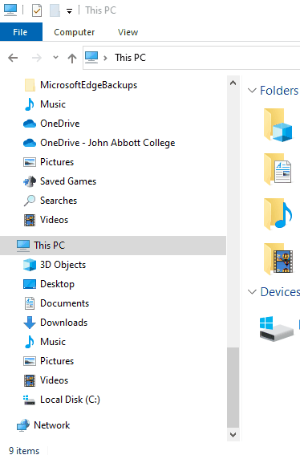

# Basic Computer Terminology

Computers are made of both hardware and software.

 

### **Hardware vs. software**

<a href="https://www.youtube.com/watch?v=NARrnGza4kA"><em>Professor Adam Morgan Hardware vs Software</em></a>

> **Hardware** refers to the **physical structure** of the computer. 
>
> *Basically the stuff you can touch.*

Some examples are the hard drive, central processing unit, hardrive, USB ports, etc.

> **Software** is any **set of instructions** that tells the hardware **what to do** and **how to do it**.
>
> The stuff you cannot touch.

This includes things like the operating system and applications like Google Chrome and Microsoft Word.

  

## Basic Computer Parts

We'll be making lots of references to computer parts so let's briefly go over the most important ones:

- **CPU** or Central Processing Unit
- **RAM** or Random Access Memory
- **Hard-drive** or Storage Disc

 

### CPU

 

The CPU (Central Processing Unit), also called the processor has the role of **executing instructions of a software program**.

The "power" of a CPU is determined by how many instructions it can execute per second, which is usually measure in **gigahertz GHz**  (billions of instructions per second).

 

### RAM

 The RAM (Random Access Memory), is used to **temporarily hold information** while the CPU is processing it.

The CPU does not access information directly form the Hard drive because the Hard drive is very slow compared to the CPU (it would have to wait too long). Therefore the RAM temporarily loads data and instructions and passes it to the CPU.

RAM is measured in gigabytes (GB). **The more RAM you have, the more programs you can have open at the same time**.

However, once the computer is **powered off, all information is erased from the RAM**.

 

### Hard drive or Storage Disc

 

The hard drive is where your software, documents, movies, and other files are stored. The hard drive is **long-term storage**, which means the data is still saved even if you turn the computer off or unplug it.

When you run a program or open a file, the computer copies some of the data from the **hard drive** onto the **RAM**. When you **save** a file, the data is copied back to the hard drive.

Older hard drives use a spinning disc store information (see image above). Modern drives use a technology called **SSD or Solid State Drives**, which has no moving parts and are much faster than spinning discs. SSD's allow your computer to **start up and load programs faster.**

The storage space of a hard drive is measure in gigabytes (GB), which is the same unit used to measure the RAM. Some discs can store more than 1,000x GB which is the equivalent of a Terabyte (TB).

 

### Computer as a System

Together the parts above form a system. Look at them as the **resources available** for your computer system to get things done.

 

## Finding Computer Specs (in Windows)

To find out how many resources we have, let's look at the specifications for our computers.

There are many ways to find this information. Some of the simplest ones are:

### Processor & RAM

1. Open the File Explorer

   - ( by typing "File Explorer" in the Windows Start Menu ) 

2. Right click on the "This PC" icon

3. Select "Properties"

4. Note the processor type and amount of RAM

   

### Storage Space

For the amount of long-term storage space (assuming you only have one storage disk):

1. Open the File Explorer
2. Right click on the "Local Disk (C:)" icon
3. Select "Properties"
4. Note the capacity of your disk

 