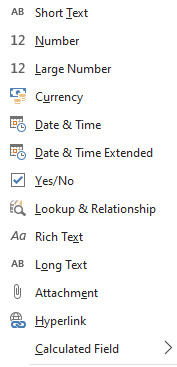
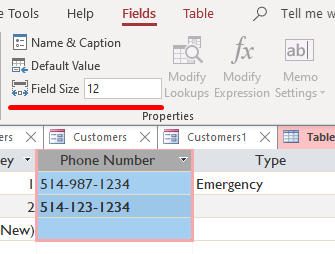
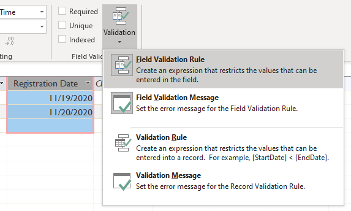
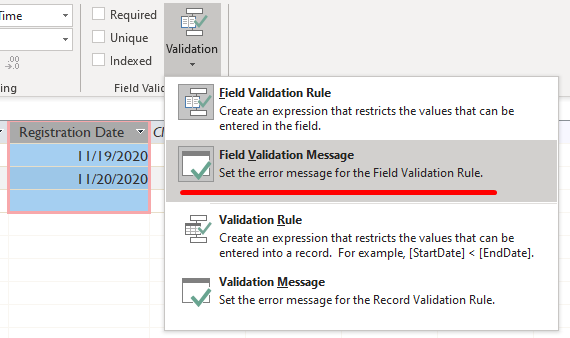
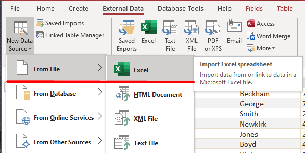

# Access Tables

We will look into the following aspects of working with tables:

1. Viewing tables and moving through records.
2. Modifying and saving records.
3. Creating a Table from scratch.
4. Creating a Table with data from Excel.

> 📖 For this section of the notes please refer to the following resources:
>
> - [Working with Tables](https://edu.gcfglobal.org/en/access2016/working-with-tables/1/) from GCF Global
> - [Modifying Tables](https://edu.gcfglobal.org/en/access2016/modifying-tables/1/) from GCF Global
> - [Build tables and set data types](https://support.microsoft.com/en-us/office/video-build-tables-and-set-data-types-997c250d-aec6-4430-8de5-a08671e13921?wt.mc_id=otc_access) from Microsoft

## Read the Warnings ⚠ 👀

Databases are designed to limit user error. Because of this, Access is very particular about how it should be used.

It is very common to get warning messages when doing operations in Access.

> Warning messages often present useful information on how to proceed or how to correct a mistake.
>
> Please take the time to read the warnings

## Primary Keys 🔑

Every table must have a field that works as the primary key.

> The primary key works as a **unique ID for each record in the table**.
>
> **A table can only have one primary key**

Your student ID at John Abbott is a form of primary key for a student account table 🏫

 

When you create a table from scratch, the first column will always be selected as the Primary Key. This can be changed later if desired.

## Data Integrity

Databases should be designed to reduce user error and guarantee data integrity.

Access offers several ways enforcing data integrity. The two most common are:

1. Defining fields with **data types**.
2. **Data validation** for each field.

### Data types

Every field in the table must be assigned a data type. There are several data types to choose from.

 

 

Data types are helpful in the following ways:

2. To guide the type of data permitted in each field.
2. To control the size of data entered in each field.

> For a description of all the available data types, see the following page from Microsoft:
>
> [Data types for Access desktop databases](https://support.microsoft.com/en-us/office/data-types-for-access-desktop-databases-df2b83ba-cef6-436d-b679-3418f622e482)

To control the number of characters permitted in each field:

1. Select the desired field to be controlled
2. Change the value of ***Field Size***

 

 

### Data Validation Rules

It is possible to validate the data being entered into a field in order to reduce mistakes.

 

Consider the field ***Registration Date***.

Let's apply a validation rule where all entered dates need to be:

- Either the current date

  OR

- Be in the future

  

>  It's possible to combine multiple validation rules with the keywords: OR , AND

1. Select the *Registration Date* field and from the ***Fields* menu** select *Field Validation Rule*.

 

2. Use the *Expression Builder* to create a validation rule.

   - Similarly to Excel, you can use the build-in functions or enter your own values

    

   

 

3. Add a *Field Validation Message* that users will see when they enter data that does not follows your validation rule

    

   

    

   

 

## Importing Data from Excel

To import data from an existing Excel sheet do the following:

1. Select the *External Data* menu
2. Select *New Data Source*
3. Select *From File* and choose *Excel*

 

Follow the wizard to choose how to convert your data.

**Pay close attention to the following:**

1. Select if you will create a new table or append it to an existing table
2. Carefully check the data type for each field
3. Decide on a primary key
   1. You can either use a column from the spreadsheet or
   2. Let Access create a new field as the primary key.

## Exercises

Download the file *Departments.xlsx* available in Teams under Week 13.

### Exercise 1

1. Start a new database and create a table to hold the data contained in the Excel sheet.
2. Populate the first 3 records of the table manually
3. Add the following data validation:
   1. The department ID is only 2 characters long.
   2. The phone numbers are no longer than 15 characters.
   3. The suite Number must be bigger than 500.

### Exercise 2

1. Import that entire Excel spread sheet as a new table in Access.