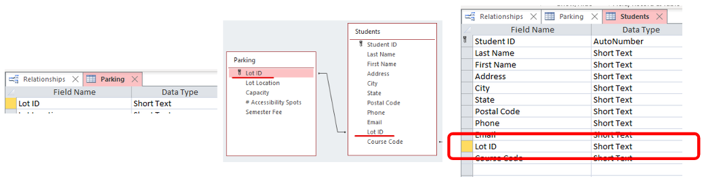
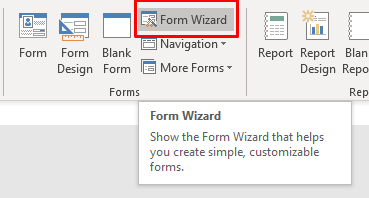

# Linked Tables & Forms

Tracking relationships between the tables is reason why we have databases.

In this lesson we will look at how to create this relationship and how to use forms that pull take from connected tables.

> 📖 For this section of the notes please refer to the following resources:
>
> - [Create relationships with the Lookup Wizard](https://support.microsoft.com/en-us/office/video-create-relationships-with-the-lookup-wizard-692775ed-5f4f-4d47-8153-d65c13ffc799) by Microsoft
> - [Create relationships with the Relationships Pane](https://support.microsoft.com/en-us/office/video-create-relationships-with-the-relationships-pane-51c67574-c0e3-4ba3-b3f8-06f2b9b4d9a9) by Microsoft
> - [How to Create the Relationship - pg 7](https://apps.kennesaw.edu/files/pr_app_uni_cdoc/doc/Access_2016_PC_Relational_Databases_and_Subforms.pdf#page=7), by Kennesaw University

## Keys must be of the same type

In order to connect tables we need to link a key from one table to a field in another table.

>  **Both keys must be of the same data type**
>
> The key in the "other" table is also known as **foreign key**

## Forms for Linked Tables

Creating a form for linked tables is similar to creating a form for single tables.

1. Use the form wizard.

2. Select fields from more than one table.

   

   

## Exercises

### Exercise 1

Refer to the database file Student_Parking.accdb in Teams under week 15.

1. Create a relationship between the *Parking Lots* table and the *Students* table so that:

   - a student can buy a parking spot at a parking lot.

2. Add LOT-1A to the following students (in the Lot ID field)

3. 1. Nakindria Gray
   2. Emily Zornes

4. Add LOT-2A to the following students

5. 1. James Porter
   2. Jean Woodward
   3. Amanda Snyder

4. Create a form for each parking lot that shows which students are associated with that lot.

### Exercise 2

Use the database from Exercise 1 (including the link between *Students* table and *Parking Lots* table) and generate a report that shows all the license plates allows to part on front of Buildings C and D

