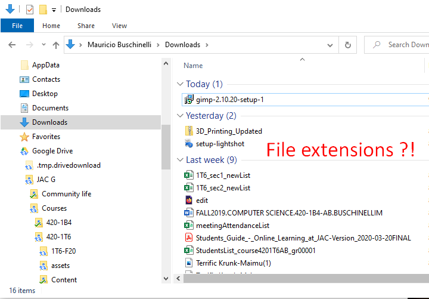
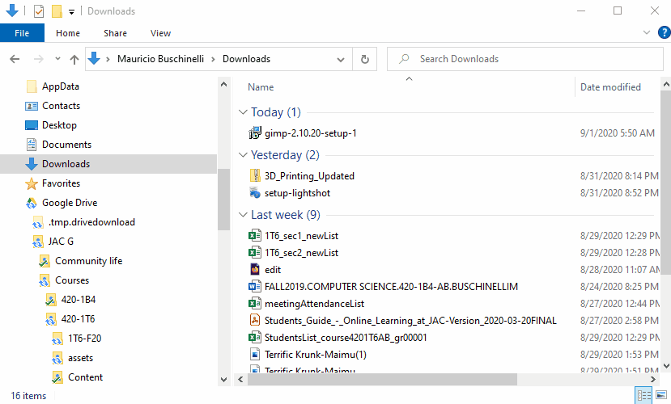
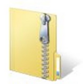
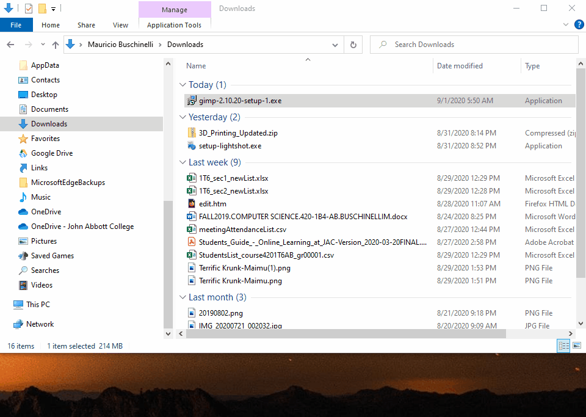
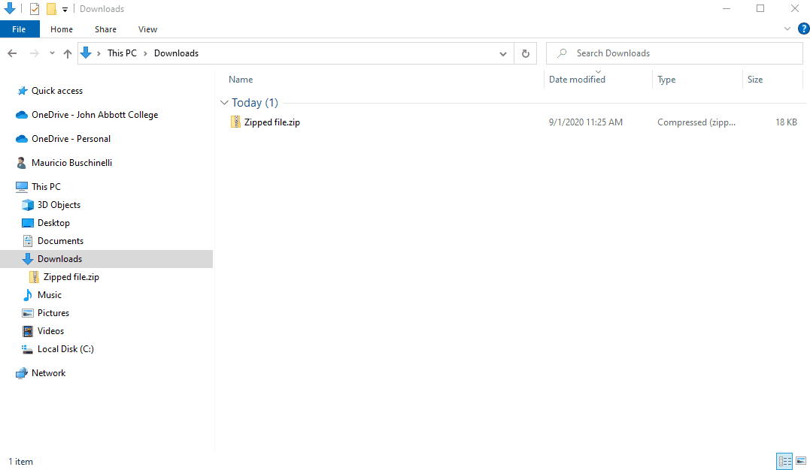

# Intro to Operating Systems

In this section we will take a look at how the operating system software interacts and controls the hardware.

Previously we had defined **software** as: *any **set of instructions** that tells the hardware **what to do** and **how to do it**.*

Let's focus on two types of software: **the operating system and application software**

 

**Operating System / System Software**

>  An operating system is a set of programs that:
>
> - Run inside the hardware,
> - manage the hardware resources,
> - host application software

 

[

<a href="https://www.addictivetips.com/mobile/an-introduction-to-modern-mobile-operating-systems/"><em>Examples of Mobile Operating Systems</em></a>

 

**Application Software**

> Programs that run and execute instructions inside the operating system.

 

<a href="#"><em>Hosting relationship between Hardware and Software</em></a>

 

## The Computer File System

Every single program, image, video, document, etc, exists in your computers as file located somewhere in the File System.

 

 

The computer file system is organized as a trees, where the origin of each tree is the **root directory**

In Windows, the root directories are assigned a letter and usually represent a Storage Drive.

 

<a href="#"><em>Windows file system with four root directories (A:, C:, D:, F:)</em></a>

 

Files systems normally contain:

- **Data** (the files)
- **Directories** (folders)
- **Metadata** (information about the data itself)
  - File size
  - File type (or file extension)
  - Time modified

 

### File Types

Each file can hold information in a multitude of different formats.

For example, an image file stores image information in a completely different way than a text file.

> To quickly distinguish between the different types files, we use a file extension at the end of each file type

 

Here are some examples of file types and their extensions:

| **Images** | **Documents** | **Audio** | **Video** | Compressed files |
| ---------- | ------------- | --------- | --------- | ---------------- |
| .png       | .docx         | .mp3      | .mp4      | .rar             |
| .jpeg      | .txt          | .wav      | .avi      | .zip             |
| .gif       | .html         | .flac     | .webm     | .7z              |

 

### File Manager Software

> A File Manager is an application software that helps us navigate, find, organize and manage files and folders in file system.

Compare this to the way you organize your notes and important documents at home

 

 

In macOS the file manager software is called **Finder**.

In Windows the file manager is called **File Explorer**.

 

 

### Showing file extensions

By default File Explorer hides the file extensions. 

 

Microsoft choose to do this to simplify the user interface and not overwhelm new users.

**If you would like to see the file extensions directly on File Explorer you have to enable it**

Enabling file extensions is not necessary but it will allow you to better understand what kinds of files you are dealing with "under the hood".

 

 

To enable the file extensions in File Explorer select the *View Menu* and click on the *File name extensions* check box.

 

 

## Compressed Files

> Some files in the computer can be compressed in order to save space. 
>
> Compressed files are typically called **Zipped files**.

 

In order to compress a file you need a **File compressor program**. 

Windows comes with a File Compressor program by default but you can choose to install other programs that achieve the same task.

Here are some examples of the File Compression programs and their respective file formats:

| Name of Compression Program | Compressed file type extension | Icon                                                         |
| --------------------------- | ------------------------------ | ------------------------------------------------------------ |
| Windows Default Compressor  | .zip                           |  |
| 7-Zip                       | .7z                            |  |
| WinRAR                      | .rar                           |  |

 

### Zip and Unzip Files

To zip (compress) or unzip (extract) files follow the instructions below:

#### Compressing Files	

1. Locate the file or folder that you want to zip.

2. Right-click the file or folder, select **Send to**, and then select **Compressed (zipped) folder**.

A new zipped folder with the same name is created in the same location.  To rename it, right-click the folder, select **Rename**, and then type the new name.

 

 

#### Extracting Files

1. Locate the zipped folder that you want to unzip (extract) files or folders from.

2. Do one of the following:

- To unzip a single file or folder, open the zipped folder, then drag the file or folder from the zipped folder to a new location.

- To unzip all the contents of the zipped folder, right-click the folder, select **Extract All**, and then follow the instructions.

   

 

#### ⚠ Using Zipped "Folders"

> The contents inside a zipped file are READ-ONLY!
>
> You will not be able to modify them without extracting first.

 

In windows you have the ability to double click onto a zipped file and File Explorer will show you the contents of the zipped file **as if you were inside a folder** - it's a trap!

  This can be very misleading and stressful when working on assignments or tests.

**Please get into the habit of always extracting a compressed file before working on it.**

 

## Exercises

In Lea, you will find a compressed file under Week 2. Please complete the following activity:

1. Download the file: *Practice exercise - Compressing Files*
2. Decompress it in a location of your choice
3. Organize the files into folders:
   - Create a main folder named *Practice1*
   - Create a folder for each file type
     - Ex.: Images, Videos, Documents
4. Create and save an Excel file (empty)
   - New -> Save As
5. Compress the main folder *Practice 1*
6. Upload the compressed folder to Lea