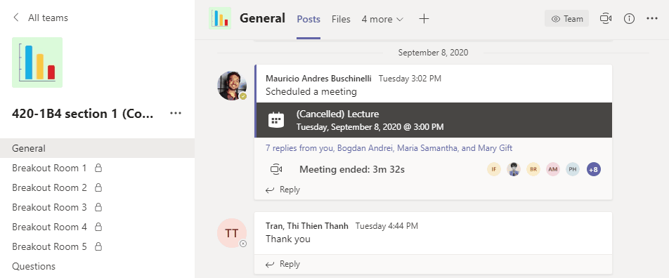

# Intro to Excel pt.2

## Cell References & Functions

 

> 📖 For this section of the notes please refer to the following resources from GCF Global
>
> - [Relative and Absolute Cell References](https://edu.gcfglobal.org/en/excel/relative-and-absolute-cell-references/1/)
> - [Functions](https://edu.gcfglobal.org/en/excel/functions/1/)

 

Each of the chapters shared above include a practice workbook that we will complete in class.

 

## Exercises

Please refer to the files available in Teams under **General Files > Class Materials > Week 3 **

 

 

