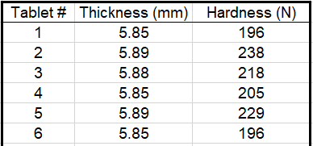
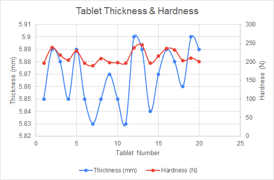
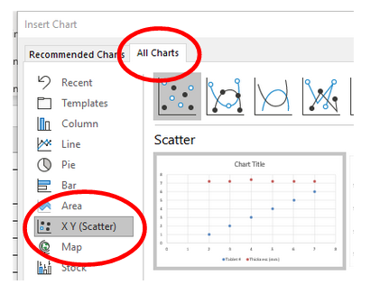
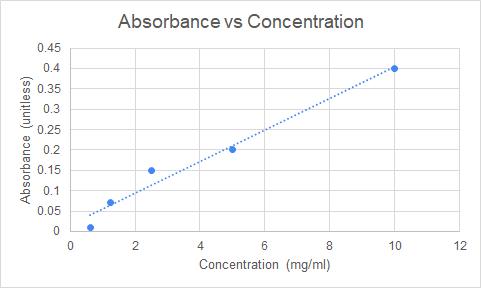

# Manipulating Graphs

This section will show how to manipulate your graph in order to create more interesting visualizations.

## Secondary Axis

A typical graph is made of one X axis and one Y axis.

However, sometimes different types of data can be collected on the same item. 

If there is a relationship between these different types of measurements you might want to show it in the same graph.

 

For example, for a sample of manufactured tablets the thickness and hardness were measured.

 

One way to illustrate the thickness of each tablet would be to put Tablet # on the X-axis and Thickness on the Y-axis:

 

If we wanted to add a new measurement such as Hardness we would need a new axis since both the current X and Y axis are already being used.

> In Excel we can add a Secondary axis to display two sets of data **as long as the data shares a common axis**

 

Following the example above, we could add the Hardness measurements as a new axis on the right side of the chart.

 

 

This way we can see that there seems to be relationship between tablet thickness and Hardness.

- When there is a peak in thickness (blue line), there is **generally** a peak in hardness (red line).

 

### Combo Charts

**Secondary Axis are achieved in Excel with combo charts**

See the link below to learn how to create a secondary axis:

> 📖 For this section of the notes please refer to the following resources
>
> - [Add or remove a secondary axis in a chart in Excel](https://support.microsoft.com/en-us/office/add-or-remove-a-secondary-axis-in-a-chart-in-excel-91da1e2f-5db1-41e9-8908-e1a2e14dd5a9) from Microsoft Support

 

### Scatter Charts

When you are not sure of the type of chart that will best describe your data, a good starting point is a Scatter Chart.

> Scatter Charts offer the most flexibility when trying to identify patters or relationships.
>
> It is guaranteed to represent your data series as X and Y data (unlike the line chart which will sometimes add the data as separate data sets).

 

### Selecting non-adjacent data

Sometimes you might want to select data that is not side by side.

For example, in the table below, Tablet# and Thickness are not immediately beside each other.

 

To select non-adjacent data:

1. Select the data in the first column using the mouse (click and drag)
2. Press and hold down the key "Ctrl" in your keyboard.
3. Select the second column using the mouse (click and drag)

 

## Trendlines

Trendlines can be added to an graph to easily visualize a trend in the date.

There are different types of trendlines that can be used. The most common is a linear trendline.

 

 

See the link below to learn how to create a trendline:

> 📖 For this section of the notes please refer to the following resources
>
> - [Add a trend or moving average line to a chart](https://support.microsoft.com/en-us/office/add-a-trend-or-moving-average-line-to-a-chart-fa59f86c-5852-4b68-a6d4-901a745842ad) from Microsoft Support

 

### Exercises

Please refer to the files *Wk4_graphing_exercises.xlsx* available in Teams under **General Files > Class Materials > Week 4**

**Combo Charts**

1. Using the sheet **tablets** create a combo chart with the *High compression force* data. Try to observe if there is any **relationship between tablet weight and thickness**.
2. Now recreate the same type of combo chart with the *Low compression force* data. Do you observe the same type of relationship?

**Trendlines**

3. Using the sheet **Absorbance** create a Scatter chart and add a trendline to it.

