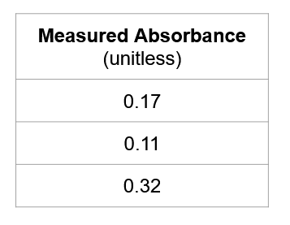

# Equation of a line

In the previous section we learned to add trendlines to a data set.

Once a trendline has been added, it is possible to extract the equation of that line and use those values to perform additional analysis on the data set.

 

The equation of a line is typically described as:

 

 

> If the **slope** and the **y-intercept** are known, then for any given X value we can find the respective Y value **and vice-versa**.

 

There are two ways of extracting the equations of a line from plotted data in Excel:

- Display the equation on the graph and manually write down the Slope and Y-intercept constants.
- Use the build-in `SLOPE` and `INTERCEPT` functions (prefered method)

 

See the links below to learn how to extract the equation of a line from Excel:

> 📖 For this section of the notes please refer to the following resources
>
> - [Excel trendline types, equations and formulas](https://www.ablebits.com/office-addins-blog/2019/01/16/excel-trendline-types-equations-formulas/) from Ablebits.com

 

## Exercises

Please refer to the files *Wk4_graphing_exercises.xlsx* available in Teams under **General Files > Class Materials > Week 4**

 

**Finding unknown concentrations.**

1. Using the sheet **Absorbance** create a Scatter chart and add a trendline to it.

2. Extract the slope and the y-intercept and recreate the equation of a line.

3. Using this new equation, find what would be the concentrations associated with the following absorbances:

   

 

**Hardness vs Thickness**

1. Using the sheet **tables** create a Scatter chart of Hardness vs Thickness for the High compression force data.
2. Add a linear trendline to the data
3. Extract the Slope and y-intercept of the line
4. Find what would be the hardness value of table with a thickness value of 5.91N ?