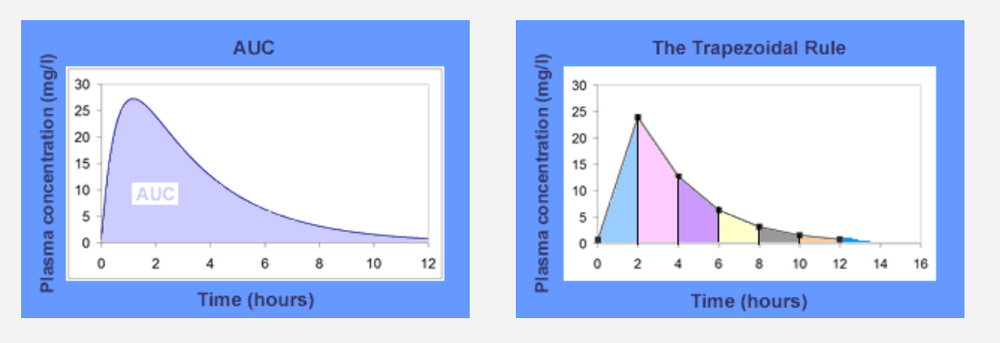
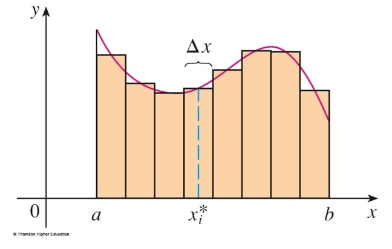
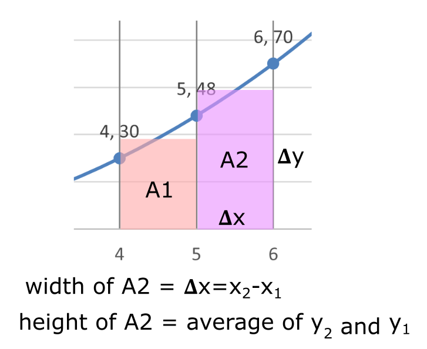

# Area Under a Curve (AUC)

There are many situations were the Area Under a Curve (AUC) can provide additional information about the data.

This happens because **the area under a curve has a mathematical relationship with the curve**. [See Introduction to Integration for more info.](https://www.mathsisfun.com/calculus/integration-introduction.html)

 

<a href="https://en.wikipedia.org/wiki/Integral"><em>Area of the region bounded by its curve</em></a>

 

> In the field of [pharmacokinetics](https://en.wikipedia.org/wiki/Pharmacokinetics), the **area under the curve** (**AUC**) describes the variation of a drug [concentration](https://en.wikipedia.org/wiki/Concentration) in [blood plasma](https://en.wikipedia.org/wiki/Blood_plasma) as a function of time.
>
> In practice, the drug concentration is measured at certain points and the [trapezoidal rule](https://en.wikipedia.org/wiki/Trapezoidal_rule)(rectangular approximation) is used to estimate AUC.
>
> *Wikipedia* - [Area under the curve (pharmacokinetics)](https://en.wikipedia.org/wiki/Area_under_the_curve_%28pharmacokinetics%29)

 

This area under the curve is dependant on the rate  of elimination of the drug from the body and the dose administered.

 

 
<a href="https://en.wikipedia.org/wiki/Integral"><em>Theoretical vs calculated AUC with the trapezoidal rule </em></a>

 

## AUC with Excel

We can use Excel to calculate the area under a curve. To do this we use the following approximation:

> 1. Breakdown the area under a curve into small rectangles since the area of a rectangle is easy to calculate. 
> 2. Sum the area of all the rectangles to get the total area.

 

<a href="https://www.math.upenn.edu/~rimmer/math103/notes/complete/5pt1and3.pdf"><em>Area under a curve broken down into rectagles</em></a>

 

To see this, consider the following data points platted on a Scatter graph with smooth lines:

 

 

We we tried to approximate the area of a small section of the diagram we would have the following:

 

 

In Excel we will calculate 𝚫x and 𝚫y and then multiply them together to get the area of each rectangle.

 

> Please refer to the file *AreaUnderCurve.xlsx* in Teams under week 7

