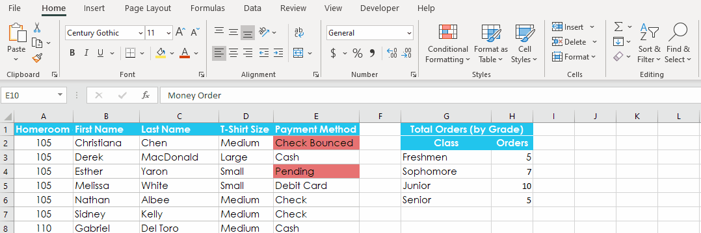

# Sorting, Filtering & Conditional Formatting

 

> 📖 For this section of the notes please refer to the following resources from GCF Global
>
> - [Using Find & Replace](https://edu.gcfglobal.org/en/excel/using-find-replace/1/) 
> - [Freezing Panes and View Options](https://edu.gcfglobal.org/en/excel/freezing-panes-and-view-options/1/) (not including split views)
> - [Sorting Data](https://edu.gcfglobal.org/en/excel/sorting-data/1/)
> - [Filtering Data](https://edu.gcfglobal.org/en/excel/filtering-data/1/)

 

Each of the chapters shared above include a practice workbook that we will complete in class.

 

## Be careful with Auto-sorting ⚠

Excel can do many things "automatically" for us.

However, to do this, Excel makes some assumptions about how our spreasheets are organized and sometimes these assumptions are wrong.

> Be careful when sorting data and make sure that related fields are moving along with the data being sorted.	

 

In the animation below, notice how the selected range is the only thing being sorted. The neighbouring data that is related to those cells are not being sorted.

 

