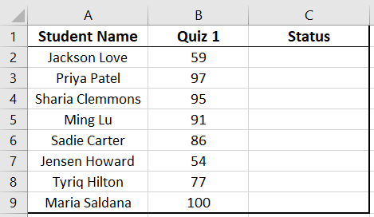

# If and Count in Excel

In some cases, it is desirable to manipulate data only if the data meets certain criteria.


## IF Function

For example, for a list of student's grades, you might want to output the word "PASS" or "FAIL", depending on the grade for a class.

<br>



<br>

To do this, we can use the **=IF function** in excel

> The **IF function** checks whether a condition is met. It returns one value if the condition is met (TRUE) and another value if the condition is not met (FALSE).

<br>

The specific syntax (order or the parameters and conditions) is as follow:

<br>


<br>

**Condition**: the criteria that we are checking. It must result in true or false.

**Value if true:** the new value of the cell if the **condition** is true.

- If this value is a text, it must be wrapped in double quotes ""

**Value if false:** the new value of the cell if the **condition** is false.

- If this value is a text, it must be wrapped in double quotes ""

<br>

In the school grades example above, if the pass or fail grade was 60, we would use the following command in the first cell of the "Status" column:


<br>

The condition is that the value inside cell B2 is greater than 60.

<br>

## Comparison Operators

There are a few comparison operators:

| Operator | Description   |
| -------- | ------------- |
| <        | less than     |
| >        | more than     |
| =        | equals to     |
| <>       | not equals to |

<br>

### Possible things to compare

When using the operators above, it's possible to compare:

- Text

  - Must wrap text with double quotes (eg. *“Sold”*)

- Numbers

- Dates

  - Must refer to a cell containing the date. You cannot add the data in the `=IF( )` formula.

    

<br>

## COUNTIF & SUMIF formulas

The **COUNTIF** and **SUMIF formulas** are similar to **IF**. They will count and sum if a specific condition is met.

<br>


<br>


<br>

In the SUMIF formula you can specify a range to be summed that is different from the range to be compared against the condition.

<br>

> For `COUNTIF` and `SUMIF` **you must wrap the operator and the value  with double quotes**


Using a date in the condition:

```
=COUNTIF(A1:A34, "<11/01/2020")
```

<br>