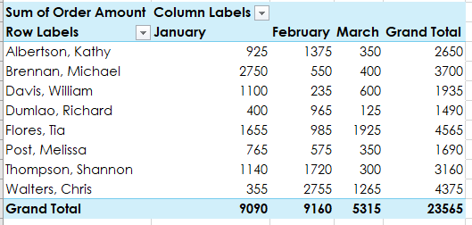

# Removing duplicates

 

> 📖 For this section of the notes please refer to the following resources from Excel Easy
>
> - [Remove Duplicates](https://www.excel-easy.com/examples/remove-duplicates.html)

 

# PivotTables

 

> 📖 For this section of the notes please refer to the following resources from GCF Global
>
> - [Intro to PivotTables](https://edu.gcfglobal.org/en/excel/intro-to-pivottables/1/)

 

Please download and complete the practice book provided in the link above, including the challenge. 

 

## What are you looking for?

PivotTables are very flexible and can be organized in many different ways. 

It is not always clear how to organize the rows, columns and values of a PivotTable.

> To help you organize the table, you need first to understand what kind of information you are trying to extract from the data.

 

From the question being asked, try to identify:

- What am I **trying to measure**?
  - This is the **Value** that you are looking for.
- How do I want this **data organized**?
  - This will determine what are the **columns and rows** of your table.

 

For example, if we wanted to answer the following question:

**How much was sold by each salesperson on a monthly basis? **

 

What are we trying to measure: **How much as sold.**

How do we want this organized: **per salesperson and per month**.

In this case, we will add "Order Amount" to *Values*, and "Salesperson" and "Month" to the *Columns* and *Rows*. The correct order of row and columns depends on what is easier to visualize.

 

