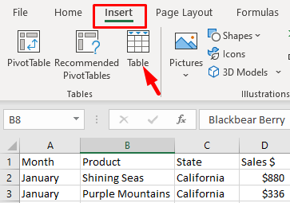
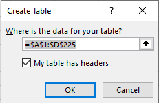

# Removing duplicates

 

> 📖 For this section of the notes please refer to the following resources from Excel Easy
>
> - [Remove Duplicates](https://www.excel-easy.com/examples/remove-duplicates.html)

 

# PivotTables

 

> 📖 For this section of the notes please refer to the following resources
>
> - [Intro to PivotTables](https://edu.gcfglobal.org/en/excel/intro-to-pivottables/1/) from GCF Global;
> - [Create a PivotTable](https://support.microsoft.com/en-us/office/create-a-pivottable-to-analyze-worksheet-data-a9a84538-bfe9-40a9-a8e9-f99134456576?ui=en-us&rs=en-us&ad=us) by Microsoft;
> - [Create a PivotChart](https://support.microsoft.com/en-us/office/create-a-pivotchart-c1b1e057-6990-4c38-b52b-8255538e7b1c) by Microsoft;

 

## What are you looking for?

PivotTables are very flexible and can be organized in many different ways. 

It is not always clear how to organize the rows, columns and values of a PivotTable.

> To help you organize the table, you need first to understand what kind of information you are trying to extract from the data.

 

From the question being asked, try to identify:

- What am I **trying to measure**?
  - This is the **Value** that you are looking for.
- How do I want this **data organized**?
  - This will determine what are the **columns and rows** of your table.

 

For example, if we wanted to answer the following question:

**How much was sold by each salesperson on a monthly basis?**

 

What are we trying to measure: **How much as sold.**

How do we want this organized: **per salesperson and per month**.

In this case, we will add "Order Amount" to *Values*, and "Salesperson" and "Month" to the *Columns* and *Rows*. The correct order of row and columns depends on what is easier to visualize.

 

 

## Pivot Tables Exercises

### Exercise 1 - Tea Sales

Download the Excel file *Tea Sales.xlsx* available in Teams under Week 9.

1. **Quickly transform the data into an Excel Table.**

   1. Click on any cell in the dataset and select *Insert* > *Table*.

   2. Make sure the correct range is selected and check *My table has headers*.

       

      

    

   

 

2. Create a Pivot Table to visualize the following information:

   **For each state, how much revenue was made per tea on a monthly basis.**

   

3. Sort the table by best selling month in descending order (big to small).

   

4. Insert a PivotChart to illustrate the data.

 

### Exercise 2 - Sociology Books

Download the Excel file *SociologyBooks.xlsx* available in Teams under Week 9.

1. Create a Pivot Table to visualize the following information:

   **Which book editions had the most units sold?**

   

2. Organize the books by discipline.

   

3. Sort the total units sold by largest to smallest.

